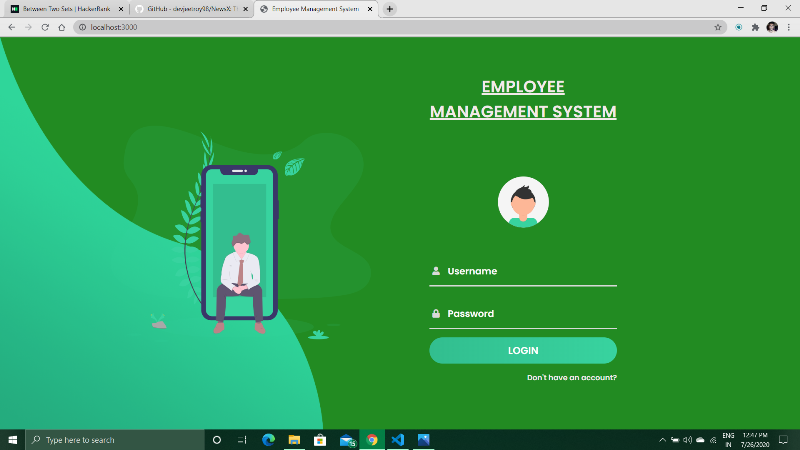

# Employee-Management-System
A mini website built in the field of Web Development using Javascript Engine and Framework like Nodejs, Expressjs and Mongodb. 
It used to stores, manages and manipulates the employee data. For this project, we have used ejs template to get the data from Mongodb and display in the html form.

At the beginning, just download the project and open in your text editor like VS Code. If you are using VS Code then simply open the folder in it.
VS Code comes with in-built terminal, go to the terminal and type "npm install" to install all the dependencies into the environment.

Otherwise you can type it in the Command Prompt by adding the path of the folder.
Remember we must have Nodejs installed in our system, Otherwise npm will not work. So install it from its official site https://nodejs.org/en/.

Now we have to install all the packages related to this project one by one as follows:

1.	To install Expressjs type "npm install express" in the terminal.

2.	To install the application generator tool, express-generator, to quickly create an application skeleton type "npm install -g express-generator" in the terminal.

3.	We have also used ejs Template. So type "npm install ejs" in the terminal. For more info visit https://www.npmjs.com/package/ejs.

4.	To create the app, type "express --view=ejs myapp" in the terminal. Here ejs Template is used to create the app. 
	This command will creates an Express app named myapp. The app will be created in a folder named myapp in the current working directory.
	For more info visit https://www.npmjs.com/package/express and http://expressjs.com/en/starter/generator.html.

5.	We have also used jsonwebtoken and localstorage for Authentication. So type "npm install local-storage --save" and "npm install jsonwebtoken" in the terminal. 
	For more info visit https://www.npmjs.com/package/local-storage and https://www.npmjs.com/package/jsonwebtoken.

6.	We have also used mongoose to connect Mongodb Compass with HTML. So type "npm install mongoose" in the terminal. For more info visit https://www.npmjs.com/package/mongoose.

7.	We have also used bcryptjs to encode the password stored in Mongodb Compass. So type "npm install bcryptjs" in the terminal. 
	For more info visit https://www.npmjs.com/package/bcryptjs.
	
8.	We have also used express-valiadator, type "npm install express-validator" in the terminal to install it. For more info visit https://www.npmjs.com/package/express-validator

9.	For Database we have used Mongodb. So install Mongodb Compass and make cluster using Atlas. For more info visit https://www.mongodb.com/. 

10.	We have also used nodemon for starting the server. So type "npm install nodemon" in the terminal to add it.

11.	After installing all the related npm packages, just start the server by typing "nodemon" in the terminal.

12.	Open your browser and go to http://localhost:3000 . If all goes well then you will see the "Welcome Page".

	
From here, you can SignUp yourself and then Login to reach the dashboard to stores, manages and manipulates the employee data.

In the Dashboard, you can see all the records of No of Department, Designation, Employee and Salary.

In the sidabar, here we have several tabs contain options to manipulate like in Add Department tab you can add the Department or in View Department tab you can see the list of it and so on.

If You wish to Add something more in this Project, Go Ahead!

